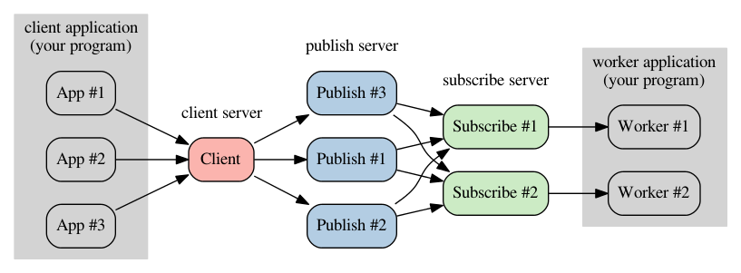
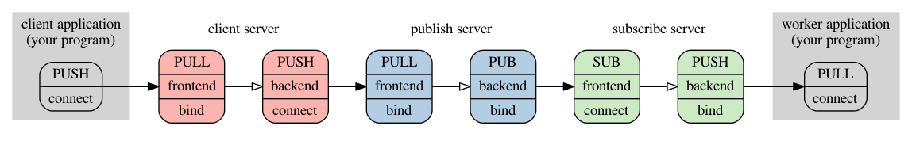
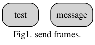
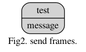
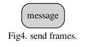
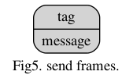
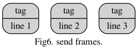
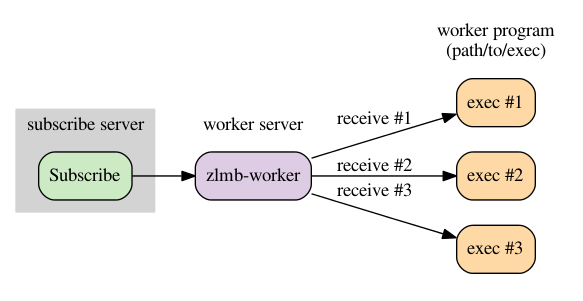

# zlmb

ZeroMQ-based Log Message broker

## Structure



## ZeroMQ socket type and connection



## Build

required.

* [cmake](http://www.cmake.org)
* [ZeroMQ](http://zeromq.org) (>= 3.2)
* [libyaml](http://pyyaml.org)
* [snappy](http://code.google.com/p/snappy) (optional)

```
% cmake .
% make
% make install
```

## Application

 command     | description
 -------     | -----------
 zlmb-server | server application

### command option

 name                      | description
 ----                      | -----------
 mode                      | execute mode
 client\_frontendpoint     | client fronend endpoint
 client\_backendpoints     | client backend endpoints
 client\_dumpfile          | client error file
 client\_dumptype          | client error type
 publish\_frontendpoint    | publish frontend point
 publish\_backendpoint     | publish backendend point
 publish\_key              | publish key string
 publish\_sendkey          | enable sending publish key
 subscribe\_frontendpoints | subscribe frontend points
 subscribe\_backendpoint   | subscribe backendend point
 subscribe\_key            | subscribe key string
 subscribe\_dropkey        | enable dropped subscribe key
 subscribe\_dumpfile       | subscribe error file
 subscribe\_dumptype       | subscribe error type
 config                    | config file path
 info                      | application information
 syslog                    | log to syslog
 verbose                   | verbosity log
 help                      | help

### execute mode

* client

  receive messages in a specified value of a client\_frontendpoint.
  send a message to the specified value of the client\_backendpoints.
  (More than one can be specified)
  client\_dumpfile tries to send the message that if you can not connect the
  client\_backendpoints outputs.

  *Usage*

  ```
  % zlmb-server --mode client --client_frontendpoint tcp://127.0.0.1:5557 --client_backendpoints tcp://127.0.0.1:5558,tcp://127.0.0.1:6668
  ```

  *Assumptions used*

  Daemon to run on the same server and client applications.

* publish

  receive messages in a specified value of a publish\_frontendpoint.
  send a message to the specified value of the publish\_backendpoint.
  sends the publish key to the first frame when it is defined the
  publish\_sendkey.
  publish key that is sent is specified by the publish\_key.
  (the default value is empty)
  messages that have been received from the other if there is no connection for
  the publish\_backendpoint are discarded.

  *Usage*

  ```
  % zlmb-server --mode publish --publish_frontendpoint tcp://127.0.0.1:5558 --publish_backendpoint tcp://127.0.0.1:5559 (--publish_key test --publish_sendkey)
  ```

  *Assumptions used*

  Distributed to the server that distributes the message from the client server
  to handle.

* subscribe

  receive messages in a specified value of a subscribe\_frontendpoints.
  (More than one can be specified)
  send a message to the specified value of the subscribe\_backendpoint.
  subscribe\_dumpfile tries to send the message that if you can not connect the
  subscribe\_backendpoints outputs.
  subscribe key that is receive is specified by the subscribe\_key.
  (the default value is empty)
  not send backendpoint the first frame received is defined if you
  subscribe\_dropkey.

  *Usage*

  ```
  % zlmb-server --mode subscribe --subscribe_frontendpoints tcp://127.0.0.1:5559,tcp://127.0.0.1:6669 --subscribe_backendpoint tcp://127.0.0.1:5560 (--subscribe_key test --subscribe_dropkey)
  ```

  *Assumptions used*

  Send me worker program for the received message.

* client-publish

  run a server that has the function of publish and client.

  *Usage*

  ```
  % zlmb-server --mode client-publish --client_frontendpoint tcp://127.0.0.1:5557 --publish_backendpoint tcp://127.0.0.1:5559 (--publish_key test --publish_dropkey)
  ```

* publish-subscribe

  run a server that has the function of publish and subscribe.

  *Usage*

  ```
  % zlmb-server --mode publish-subscribe --publish_frontendpoint tcp://127.0.0.1:5558 --subscribe_backendpoint tcp://127.0.0.1:5560
  ```

* client-subscribe

  run a server that has the function of client and subscribe.

  *Usage*

  ```
  % zlmb-server --mode client-subscribe --client_frontendpoint tcp://127.0.0.1:5557 --client_backendpoints tcp://127.0.0.1:5558 --subscribe_frontendpoint tcp://127.0.0.1:5559 --subscribe_backendpoint tcp://127.0.0.1:5560 (--subscribe_key test --subscribe_dropkey)
  ```

* stand-alone

  run a server that has the function of client, publish and subscribe.

  *Usage*

  ```
  zlmb-server --mode stand-alone --client_frontendpoint tcp://127.0.0.1:5557 --subscribe_backendpoint tcp://127.0.0.1:5560
  ```

### config

You can also read from a file format that is specified in the config yaml
configuration options.

Best options that you specified earlier in the option argument is used on a
priority basis.

*Usage*

```
% zlmb-server --mode client --config config.yml
```

Configuration file, see [config.yml](etc/config.yml).

### syslog

If the syslog option is set, a log message is output via syslog.

### compress

If I were to take effect (snappy) compress option at compile time,
to compress the message at the time sent from the client to publish
message will be thawed in time to be sent to the worker from subscribe.
(cmake -DUSE_SNAPPY=ON)

## Extend Application

 command     | description
 -------     | -----------
 zlmb-cli    | client application
 zlmb-dump   | dump message application
 zlmb-worker | worker server

### zlmb-cli

send a message to zlmb-server from the command line.

#### command line

zlmb-cli [-e ENDPOINT] [-f FILE] [-m NUM] [ARGS ...]

 name          | description
 ----          | -----------
 endpoint (e)  | connect server endpoint (DEFAULT: tcp://127.0.0.1:5557)
 filename (f)  | input file name or 'stdin'
 multipart (m) | send multi-part message size

#### usage

1. send to 'test' and 'message'.

   ```
   % zlmb-cli -e tcp://127.0.0.1:5557 test message
   ```

   

2. send to 2 part message.

   ```
   % zlmb-cli -e tcp://127.0.0.1:5557 -m 2 test message
   ```

   

3. send to file (filename: test.txt).

   send one line at a time.

   ```
   % zlmb-cli -e tcp://127.0.0.1:5557 -f test.txt
   ```

   

4. send to stdin.

   ```
   % echo 'message' | zlmb-cli -e tcp://127.0.0.1:5557 -f stdin
   ```

   

5. send to stdin and multi part.

   ```
   % echo 'message' | zlmb-cli -e tcp://127.0.0.1:5557 -f stdin -m 2 tag
   ```

   

   ```
   % cat test.txt | zlmb-cli -e tcp://127.0.0.1:5557 -f stdin -m 2 tag
   ```

   

### zlmb-dump

Reprocess messages that have been output by the dumpfile(dumptype:binary) of
zlmb-server.
Processing can be performed or retransmission of the message.
Please note that from being truncated is read dumpfile.

#### command line

zlmb-dump [-e ENDPOINT] [-c] FILE

 name          | description
 ----          | -----------
 endpoint (e)  | send server endpoint
 continue (c)  | continue end of file

#### usage

```
% zlmb-dump /tmp/zlmb-client-dump.dat
% zlmb-dump -e tcp://127.0.0.1:5557 /tmp/zlmb-client-dump.dat
```

### zlmb-worker

Because you will need to restart the program itself as well each time you
update the processing for messages that are received by the above-mentioned
cases of Worker, Worker server becomes a simple program to call the CGI.

#### command option

zlmb-worker [-e ENDPOINT] [-c COMMAND] [-t NUM] [ARGS ...]

 name         | description
 ----         | -----------
 endpoint (e) | server endpoint
 command (c)  | command path
 thread (t)   | command thread count (DEFAULT: 1)

#### usage

```
% zlmb-worker --endpoint tcp://127.0.0.1:5560 -c path/to/exec -t 3
```

Input information to the worker program, the environment variable is done by
standard input.

Worker program (path/to/exec) is executed the message was received.

Worker programs (path/to/exec) can be run a few minutes maximum thread count.



#### environment variables

* ZLMB\_FRAME: The number of frames received on ZeroMQ
* ZLMB\_FRAME\_LENGTH: The length of each frame ZeroMQ (separator ":")
* ZLMB\_LENGTH: The length of the message received by the ZeroMQ (Total of ZLMB\_FRAME\_LENGTH)

#### standard input

Message received by the ZeroMQ

## Examples

### client

Client program sends a message to connect to the client\_frontendpoint.

* [C](src/exp_client.c)
* [PHP](src/exp_client.php)
* [Python](src/exp_client.py)
* [Ruby](src/exp_client.rb)

### worker

Worker program to receive messages connected to subscribe\_backendpoint,
do any processing.

* [C](src/exp_worker.c)
* [PHP](src/exp_worker.php)
* [Python](src/exp_worker.py)
* [Ruby](src/exp_worker.rb)

### worker exec

Example of worker program to start at zlmb-worker.

* [C](src/exp_worker_exec.c)
* [PHP](src/exp_worker_exec.php)
* [Python](src/exp_worker_exec.py)
* [Ruby](src/exp_worker_exec.rb)
